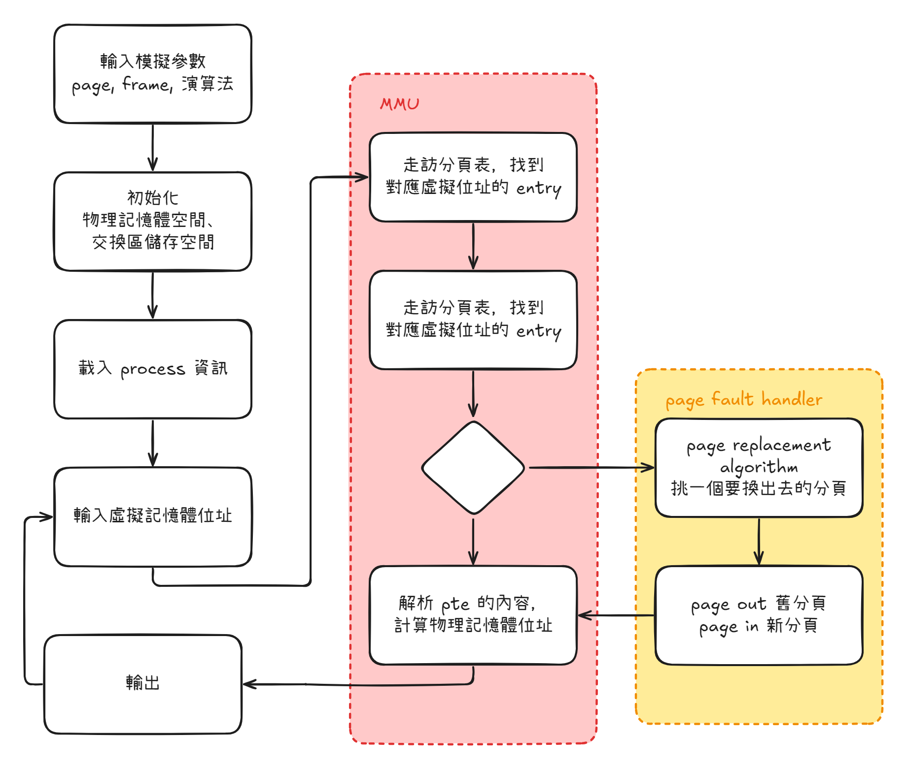
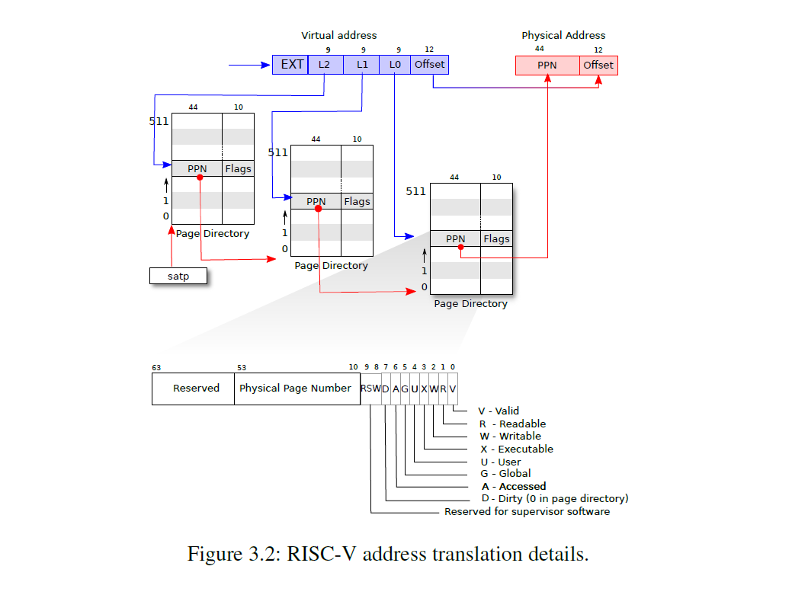

# xv6 paging simulate

大同大學作業系統期末專題，實作 paging 和 page replacement。大量挪用了 xv6-riscv 的程式。

## 安裝與使用

推薦使用 linux 系統操作。

複製此專案：
```bash
git clone https://github.com/yuto0226/paging_simulate.git
```
進入專案目錄：
```bash
cd paging_simulate
```
編譯專案：
```bash
make run
```

## 重點概念

- 使用額外的 `PTE_S` 在分頁表中紀錄是否被換出到交換區
- 維護一個 `swap_map` 紀錄交換區的使用狀況
- 預設行程會維護一個 page table 和負責記錄可用分頁的 page list
- 利用程式模擬 MMU 並實作 page fault 的分頁替換演算法



sv39 的分頁表為三級分頁表，每級大小為 9 bits。可以用 1 GB 大小的分頁表，可以提供到 512 GB 的物理記憶體空間。每個 pte, page table entry 中會有分欄的物理位址，以及 10 bits 的 flag，其中預留 3 bits 給 kernel 使用。



`proc.h` 中記錄行程的 `struct proc` 和裡面紀錄可用 page 的 `struct page *page_list`

```c
struct page {
    uint64 va;
    uint64 count;
    struct page *next;
};

struct proc {
    pagetable_t pgtbl;
    uint64 sz;                   // Size of process memory (bytes)
    uint64 frame_sz;             // Size of frame allocated
    struct page *page_list;      // 用於 FIFO 替換的頁面列表
    char name[16];
};
```

`proc.c` 的 `find_lru_page()`

```c
// 在 list 中找到 count 最少的 page，然後 pop 出 page list
uint64 pop_lru_page(struct page **list) {
    if(*list == NULL) {
        return MAXVA + 1;
    }
    struct page* curr = *list, *target, *prev=NULL, *target_prev=NULL;
    uint64 min_count = 0xffffffff;

    while(curr != NULL) {
        if(curr->count <= min_count) {
            target = curr;
            target_prev = prev;
            min_count = curr->count;
        }
        prev = curr;
        curr = curr->next;
    }
    if(target_prev == NULL) *list = target->next;
    else target_prev->next = target->next;
    uint64 va =target->va;
    free(target);

    return va;
}
```
